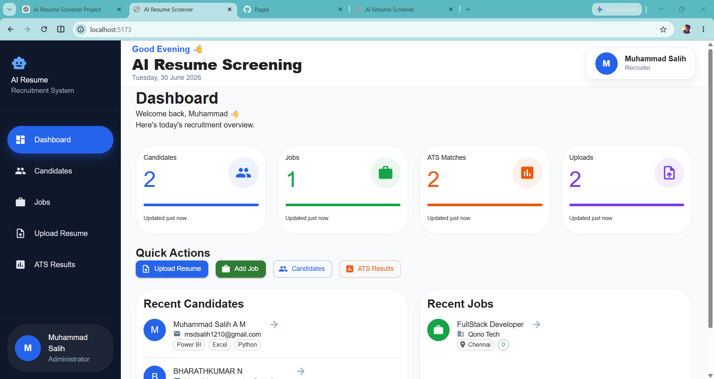
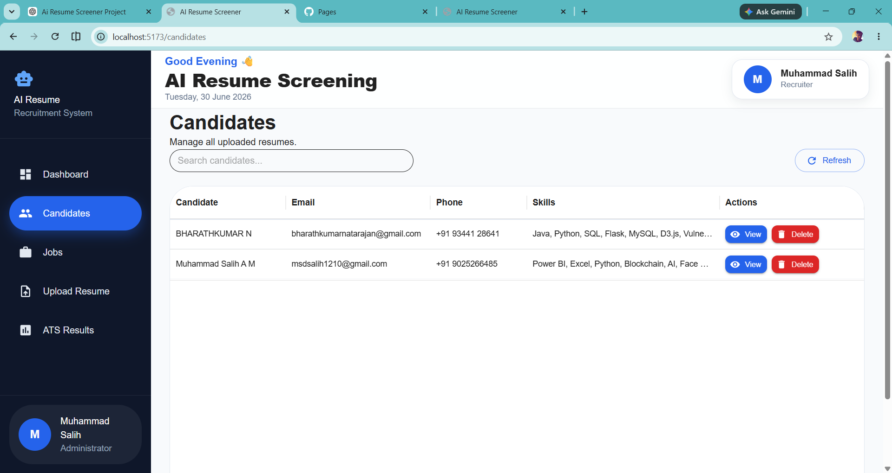
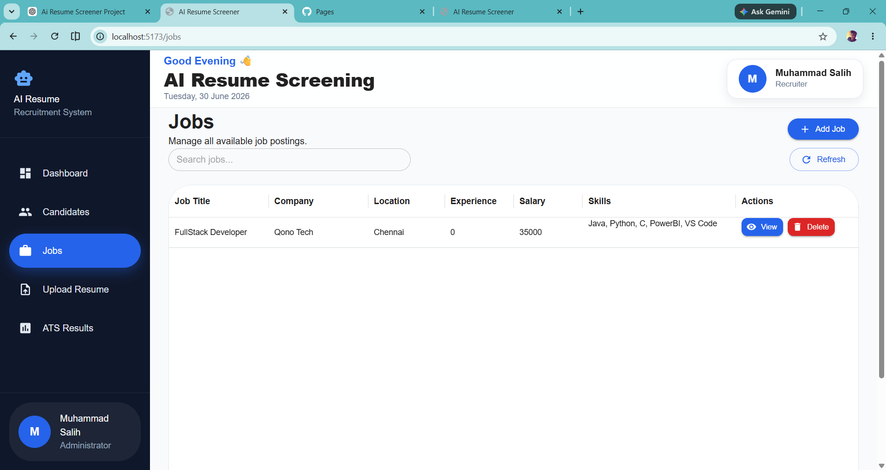
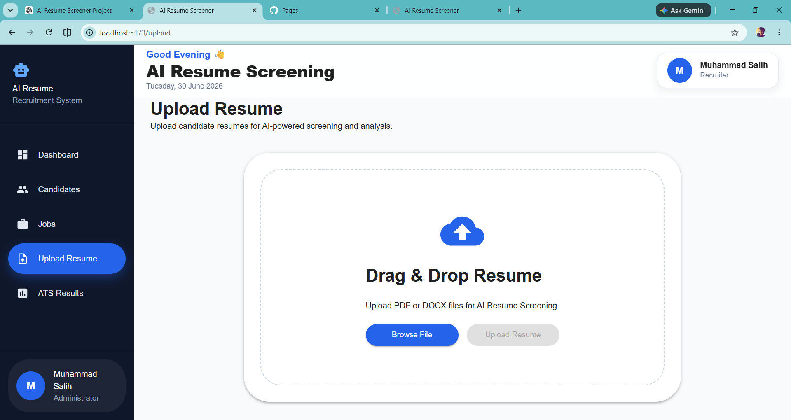
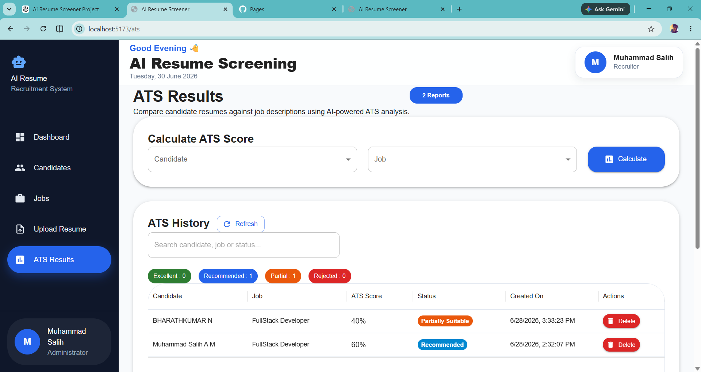

# 🤖 AI Resume Screening System

> An AI-powered Resume Screening System that helps recruiters manage candidates, jobs, resume uploads, and ATS score analysis through a modern dashboard.

---

## 📌 Overview

AI Resume Screening System is a full-stack web application that streamlines the recruitment process.

Recruiters can:

- Manage candidates
- Create job postings
- Upload resumes
- Compare resumes with job descriptions
- Generate ATS match scores
- Download ATS reports

The application features a clean and responsive Material UI dashboard for an enhanced user experience.

---

## ✨ Features

### 📊 Dashboard
- Recruitment overview
- Candidate statistics
- Job statistics
- ATS statistics
- Recent Candidates
- Recent Jobs

### 👥 Candidate Management
- Add Candidate
- Edit Candidate
- Delete Candidate
- View Candidate Details
- Search Candidates

### 💼 Job Management
- Add Job
- Edit Job
- Delete Job
- View Job Details
- Search Jobs

### 📄 Resume Upload
- Drag & Drop Resume Upload
- PDF/DOC/DOCX Support
- Resume Validation

### 🎯 ATS Resume Matching
- Compare Candidate Resume with Job Description
- Calculate ATS Match Score
- Display Matching Skills
- Display Missing Skills
- Match Percentage
- ATS Recommendation Status

### 📑 ATS History
- Search Reports
- Delete Reports
- Download PDF Report

---

## 🛠 Tech Stack

### Frontend

- React.js
- Vite
- Material UI
- Axios
- React Router
- MUI DataGrid

### Backend

- Spring Boot
- Spring Data MongoDB
- MongoDB Compass
- REST APIs

---
## 📂 Project Structure

```text
frontend/
│
├── public/
├── src/
│   ├── api/
│   ├── assets/
│   ├── components/
│   │   ├── ats/
│   │   ├── candidate/
│   │   ├── common/
│   │   ├── job/
│   │   └── upload/
│   │
│   ├── pages/
│   ├── services/
│   ├── utils/
│   ├── App.jsx
│   └── main.jsx
│
├── package.json
├── vite.config.js
└── README.md
```

---

# 🚀 Getting Started

## Prerequisites

Before running the project, make sure you have installed:

- Node.js (v18 or above)
- npm

---

## Installation

Clone the repository

```bash
git clone https://github.com/SalihMSD/ai-resume-screening-frontend.git
```

Go to the project directory

```bash
cd ai-resume-screening-frontend
```

Install dependencies

```bash
npm install
```

Start the development server

```bash
npm run dev
```

The application will be available at

```
http://localhost:5173
```

---

# 🔗 Backend

This frontend communicates with the Spring Boot backend through REST APIs.

Update the API base URL inside:

```text
src/api/axios.js
```

Example:

```javascript
baseURL: "http://localhost:8081"
```

---

# 📱 Screenshots

> Add your application screenshots inside a folder named **screenshots**.

Example structure:

```text
screenshots/
├── dashboard.png
├── candidates.png
├── jobs.png
├── upload-resume.png
├── ats-results.png
```

Then display them like this:

## Dashboard



## Candidates



## Jobs



## Upload Resume



## ATS Results



---
# 🌐 Live Demo

The frontend is deployed on **Vercel**.

**Live Website**

> https://ai-resume-screening-frontend-xi.vercel.app/

*(Update this section after deploying to Vercel.)*

---

# 🚀 Future Enhancements

- AI-powered Resume Parsing
- JWT Authentication & Role-Based Access
- Recruiter Login System
- Email Notifications
- Resume Ranking
- Candidate Shortlisting
- Advanced Search & Filters
- Analytics Dashboard
- Dark Mode
- Responsive Mobile Dashboard

---

# 🤝 Contributing

Contributions, issues, and feature requests are welcome.

If you'd like to improve this project:

1. Fork the repository
2. Create your feature branch

```bash
git checkout -b feature/new-feature
```

3. Commit your changes

```bash
git commit -m "Add new feature"
```

4. Push to your branch

```bash
git push origin feature/new-feature
```

5. Open a Pull Request

---

# 👨‍💻 Author

**Muhammad Salih**

- GitHub: https://github.com/SalihMSD
- LinkedIn: https://www.linkedin.com/in/muhammadsaliham/

---

# ⭐ Support

If you found this project helpful, consider giving it a ⭐ on GitHub.

It helps others discover the project and motivates future improvements.

---

# 📄 License

This project is licensed under the **MIT License**.

---

## 🙏 Acknowledgements

This project was built using:

- React.js
- Vite
- Material UI
- Spring Boot
- MongoDB
- Axios
- GitHub
- Vercel

---

<div align="center">

### ⭐ Thanks for visiting this repository! ⭐

Made with ❤️ by **Muhammad Salih**

</div>
